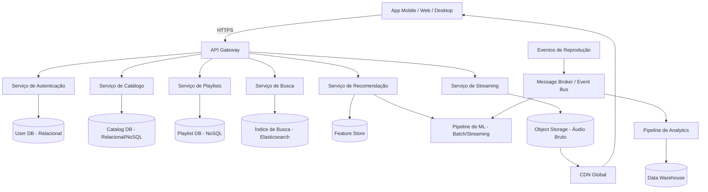
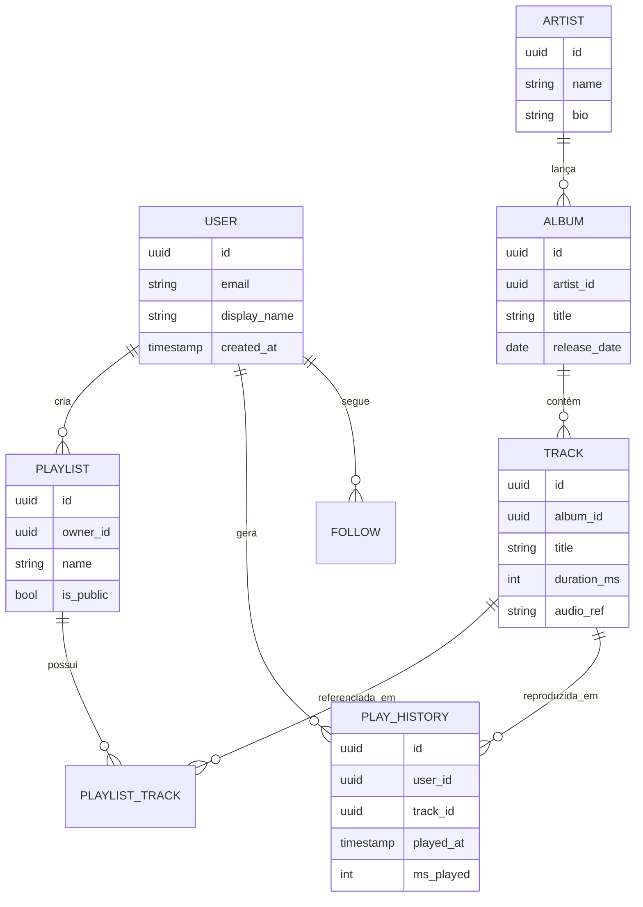
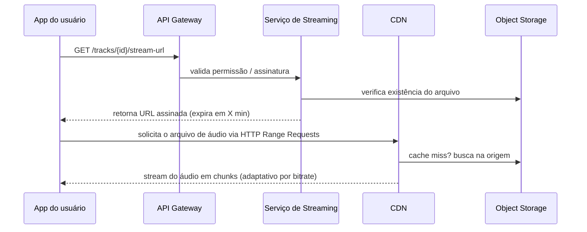

# 🎧 Arquitetando o Spotify — Estudo


Estudo de caso de **arquitetura de sistemas distribuídos**: como projetar, do zero, uma plataforma de streaming de música na escala do Spotify. O objetivo não é reimplementar o produto, e sim exercitar o raciocínio de **system design** — requisitos, estimativas de capacidade, modelagem de dados, trade-offs de escalabilidade e decisões de arquitetura — documentando o processo de ponta a ponta.

## 📋 Sumário

- [1. Contexto e objetivo](#1-contexto-e-objetivo)
- [2. Requisitos funcionais](#2-requisitos-funcionais)
- [3. Requisitos não-funcionais](#3-requisitos-não-funcionais)
- [4. Estimativas de capacidade](#4-estimativas-de-capacidade)
- [5. Arquitetura de alto nível](#5-arquitetura-de-alto-nível)
- [6. Modelagem de dados](#6-modelagem-de-dados)
- [7. Design de API](#7-design-de-api)
- [8. Streaming de áudio e CDN](#8-streaming-de-áudio-e-cdn)
- [9. Sistema de recomendação](#9-sistema-de-recomendação)
- [10. Escalabilidade e trade-offs](#10-escalabilidade-e-trade-offs)
- [11. Stack sugerida](#11-stack-sugerida)

---

## 1. Contexto e objetivo

Projetar a arquitetura de um serviço de streaming de música capaz de suportar:
- Catálogo de dezenas de milhões de faixas
- Centenas de milhões de usuários ativos
- Reprodução de áudio com baixa latência em qualquer lugar do mundo
- Playlists colaborativas, recomendações personalizadas e busca em tempo real

## 2. Requisitos funcionais

| # | Requisito |
|---|---|
| RF01 | Usuário pode buscar músicas, artistas, álbuns e playlists |
| RF02 | Usuário pode reproduzir uma faixa em streaming (sem download completo) |
| RF03 | Usuário pode criar, editar e compartilhar playlists |
| RF04 | Sistema recomenda faixas/playlists com base no histórico de audição |
| RF05 | Usuário pode curtir/salvar músicas e seguir artistas |
| RF06 | Sistema exibe letras sincronizadas (opcional) |
| RF07 | Suporte a reprodução offline (cache local no app) |

## 3. Requisitos não-funcionais

| # | Requisito | Meta |
|---|---|---|
| RNF01 | Disponibilidade | 99.95% (~4h de downtime/ano) |
| RNF02 | Latência de início de reprodução | < 200ms (p95) |
| RNF03 | Consistência | Eventual para playlists/recomendações; forte para autenticação e pagamento |
| RNF04 | Escalabilidade | Suportar picos regionais (ex: lançamento de álbum global) |
| RNF05 | Durabilidade do catálogo de áudio | 99.999999999% (11 noves, padrão object storage) |

## 4. Estimativas de capacidade

Premissas (ordem de grandeza, estilo *back-of-the-envelope*):

- **Usuários ativos mensais (MAU):** ~600 milhões
- **Usuários ativos diários (DAU):** ~200 milhões (~33% do MAU)
- **Faixas no catálogo:** ~100 milhões
- **Tamanho médio de uma faixa (áudio comprimido, múltiplos bitrates):** ~15 MB (total, somando as versões 96/160/320 kbps)
- **Armazenamento total de áudio:** 100M faixas × 15 MB ≈ **1.5 PB**
- **Reproduções por dia:** se cada DAU ouve ~20 faixas/dia → 200M × 20 = **4 bilhões de plays/dia**
- **Requisições de streaming por segundo (média):** 4B / 86.400s ≈ **~46.000 req/s** (pico pode ser 3-5x a média)
- **Tráfego de rede (streaming):** considerando bitrate médio de 160kbps por sessão simultânea, com ~20M usuários ouvindo simultaneamente no pico → 20M × 160kbps ≈ **3.2 Tbps** de banda agregada (por isso CDN é obrigatório, não opcional)

> Esses números servem para justificar decisões (ex: por que CDN, por que sharding, por que cache) — não são dados reais do Spotify.

## 5. Arquitetura de alto nível



**Decisões-chave:**
- **API Gateway** centraliza autenticação, rate limiting e roteamento para os microsserviços.
- Cada domínio (catálogo, playlists, busca, recomendação, streaming) é um **serviço independente**, com banco de dados próprio (padrão *database-per-service*), evitando acoplamento.
- **Object Storage + CDN** para o áudio: o serviço de streaming nunca serve o arquivo diretamente — apenas gera URLs assinadas apontando para a CDN.
- Um **Event Bus** (ex: Kafka) desacopla a geração de eventos de reprodução do consumo por analytics e pelo pipeline de recomendação.

## 6. Modelagem de dados



**Escolhas de banco por serviço:**
- **Usuários / Autenticação:** relacional (PostgreSQL) — dados fortemente consistentes, transações de conta/pagamento.
- **Catálogo (artistas, álbuns, faixas):** relacional ou NoSQL de documentos, com forte camada de cache (Redis) por ser majoritariamente leitura.
- **Playlists:** NoSQL orientado a documentos (ex: DynamoDB/MongoDB) — estrutura flexível, alta taxa de escrita/leitura, escala horizontal fácil.
- **Histórico de reprodução:** banco de séries temporais ou colunar (ex: Cassandra) — volume gigantesco, otimizado para escrita.

## 7. Design de API

Exemplo simplificado (REST) dos endpoints principais:

```
GET  /v1/search?q={query}&type=track,artist,album
GET  /v1/tracks/{trackId}
GET  /v1/tracks/{trackId}/stream-url      → retorna URL assinada da CDN
POST /v1/playlists
POST /v1/playlists/{playlistId}/tracks
GET  /v1/users/{userId}/recommendations
POST /v1/playback-events                 → registra evento de reprodução (assíncrono)
```

O endpoint de streaming **nunca retorna o áudio diretamente** — retorna uma URL temporária e assinada (ex: CloudFront Signed URL) para o player buscar o conteúdo direto da CDN.

## 8. Streaming de áudio e CDN

Fluxo de reprodução de uma faixa:



- Arquivos de áudio armazenados em múltiplos bitrates (ex: 96/160/320 kbps) para adaptação de qualidade conforme a rede do usuário.
- **HTTP Range Requests** permitem que o player baixe apenas os trechos necessários (bufferização progressiva), sem baixar a faixa inteira.
- CDN com múltiplos PoPs (edge locations) reduz latência global e absorve a maior parte do tráfego, protegendo a origem (object storage).

## 9. Sistema de recomendação

- **Coleta de eventos:** cada reprodução, skip, curtida e tempo ouvido é publicado no Event Bus.
- **Pipeline batch:** treina modelos de filtragem colaborativa (ex: matriz usuário-faixa) periodicamente, gerando embeddings de usuários e faixas.
- **Pipeline streaming:** atualiza sinais de curto prazo (ex: "o que você ouviu nas últimas 2 horas") para recomendações mais reativas.
- **Feature Store:** centraliza features pré-computadas (gênero preferido, artistas mais ouvidos, hora do dia típica de escuta) para servir o modelo em baixa latência.

## 10. Escalabilidade e trade-offs

| Decisão | Ganho | Custo/Trade-off |
|---|---|---|
| Microsserviços por domínio | Times e deploys independentes, escala isolada | Complexidade operacional, latência entre serviços |
| CDN para áudio | Baixa latência global, menos carga na origem | Custo de banda, invalidação de cache em atualizações |
| Consistência eventual em playlists/recomendação | Alta disponibilidade e escala | Usuário pode ver estado levemente desatualizado |
| Sharding do histórico de reprodução por usuário | Escrita distribuída, sem hotspots | Queries agregadas (ex: "top global") ficam mais caras |
| Cache agressivo no catálogo (Redis) | Reduz carga no banco principal | Necessário invalidar cache em atualizações de metadados |

## 11. Stack sugerida

- **Backend:** serviços em Python (FastAPI) ou Java (Spring Boot), conforme o domínio
- **Mensageria:** Kafka ou AWS Kinesis para o Event Bus
- **Bancos:** PostgreSQL (transacional), DynamoDB/Cassandra (alta escala de escrita), Elasticsearch (busca)
- **Cache:** Redis
- **Armazenamento de áudio:** S3 (ou equivalente) + CloudFront como CDN
- **Infraestrutura:** contêineres orquestrados (Kubernetes/ECS), IaC com Terraform
- **Observabilidade:** métricas (Prometheus/Grafana), logs centralizados, tracing distribuído (OpenTelemetry)

---

## 📌 Sobre este projeto

Este repositório é um exercício de **system design** — documentação de arquitetura, não uma implementação completa do produto. A ideia é demonstrar raciocínio de projeto de sistemas distribuídos: estimativas de capacidade, modelagem de dados, decisões de arquitetura e seus trade-offs.

## 📚 Referências e créditos

Estudei os conceitos de arquitetura de sistemas distribuídos aplicados neste case study através do canal [Renato Augusto Tech](https://www.youtube.com/@RenatoAugustoTech/videos) no YouTube, além do material disponível no GitHub de [Renato Augusto](https://github.com/RenatoAugustoFS).

---

© 2026 Gabriel Teramae Chan
