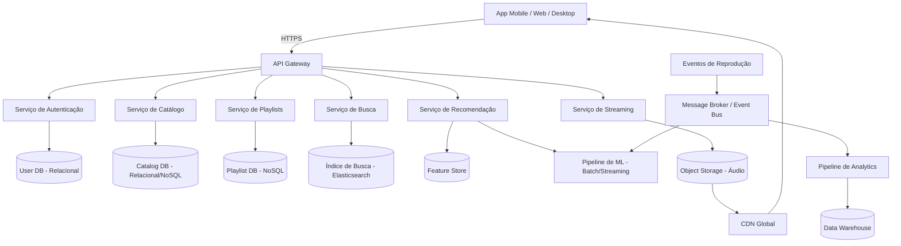
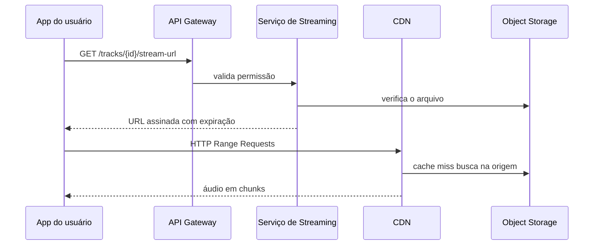

# Arquitetando o Spotify — case de system design


Estudo de arquitetura em um único Markdown. O texto projeta, no papel, uma plataforma de streaming na escala de um Spotify: requisito, conta de capacidade, modelo, API e trade-off. Não há serviço para subir aqui. Os números da seção 4 são ordem de grandeza para justificar decisão, não dado real do Spotify.

Uma fatia pequena disso está em código no repositório [arch-code](https://github.com/gabrielteramae/arch-code): URL assinada com HMAC-SHA256, HTTP Range e um endpoint de evento de reprodução que só loga.

## Stack

Nada disso está instalado neste repo. É a stack sugerida na seção 11:

- Serviços em Python (FastAPI) ou Java (Spring Boot), conforme o domínio
- Kafka ou AWS Kinesis como event bus
- PostgreSQL, DynamoDB ou Cassandra, Elasticsearch
- Redis
- Áudio em S3 (ou equivalente) e CloudFront
- Kubernetes ou ECS, Terraform
- Prometheus, Grafana, log centralizado, OpenTelemetry

## Estrutura

Só este `README.md` e um `.gitignore`. As notas são as seções abaixo:

1. Contexto e objetivo
2. Requisitos funcionais
3. Requisitos não funcionais
4. Estimativas de capacidade
5. Arquitetura de alto nível
6. Modelagem de dados
7. Design de API
8. Streaming de áudio e CDN
9. Sistema de recomendação
10. Escalabilidade e trade-offs
11. Stack sugerida

## Como ler

```bash
git clone https://github.com/gabrielteramae/arquitetando-spotify.git
cd arquitetando-spotify
```

Leia da seção 1 à 11. Os diagramas são Mermaid. Não há API, player nem banco neste repositório.

## 1. Contexto e objetivo

Projetar um serviço de streaming capaz de:

- catálogo de dezenas de milhões de faixas
- centenas de milhões de usuários ativos
- reprodução com baixa latência
- playlist colaborativa, recomendação e busca

## 2. Requisitos funcionais

| # | Requisito |
|---|---|
| RF01 | Buscar música, artista, álbum e playlist |
| RF02 | Reproduzir em streaming, sem baixar a faixa inteira |
| RF03 | Criar, editar e compartilhar playlist |
| RF04 | Recomendar faixa e playlist a partir do histórico |
| RF05 | Curtir ou salvar música e seguir artista |
| RF06 | Letra sincronizada (opcional) |
| RF07 | Reprodução offline (cache no app) |

## 3. Requisitos não funcionais

| # | Requisito | Meta no texto |
|---|---|---|
| RNF01 | Disponibilidade | 99,95% (cerca de 4 h de downtime por ano) |
| RNF02 | Latência até o áudio começar | < 200 ms (p95) |
| RNF03 | Consistência | Eventual em playlist e recomendação; forte em autenticação e pagamento |
| RNF04 | Escala | Pico regional, por exemplo lançamento global |
| RNF05 | Durabilidade do áudio | 11 noves, padrão de object storage |

## 4. Estimativas de capacidade

Premissas de ordem de grandeza:

- MAU: cerca de 600 milhões
- DAU: cerca de 200 milhões (cerca de 33% do MAU)
- Catálogo: cerca de 100 milhões de faixas
- Tamanho médio somando 96/160/320 kbps: cerca de 15 MB
- Áudio total: 100 milhões × 15 MB, cerca de 1,5 PB
- Plays por dia: 200 milhões × 20 faixas = 4 bilhões
- Média de requests de stream: 4 bilhões / 86.400 s, cerca de 46.000 req/s. O texto assume pico de 3 a 5 vezes a média
- Banda no pico: cerca de 20 milhões de sessões simultâneas × 160 kbps, cerca de 3,2 Tbps. Por isso o texto trata CDN como obrigatória

## 5. Arquitetura de alto nível



Decisões do texto:

- API Gateway concentra autenticação, rate limit e roteamento.
- Catálogo, playlist, busca, recomendação e streaming são serviços com banco próprio.
- O serviço de streaming não entrega o arquivo. Ele devolve URL assinada da CDN. O áudio fica em object storage.
- Um event bus (o exemplo do texto é Kafka) separa o evento de play do analytics e do treino.

## 6. Modelagem de dados


Banco por serviço, como o texto escolhe:

- Usuário e autenticação: PostgreSQL
- Catálogo: relacional ou documento, com Redis na frente, porque a carga é leitura
- Playlist: documento (DynamoDB ou MongoDB no texto)
- Histórico de play: série temporal ou colunar (Cassandra no texto)

## 7. Design de API

```
GET  /v1/search?q={query}&type=track,artist,album
GET  /v1/tracks/{trackId}
GET  /v1/tracks/{trackId}/stream-url
POST /v1/playlists
POST /v1/playlists/{playlistId}/tracks
GET  /v1/users/{userId}/recommendations
POST /v1/playback-events
```

`stream-url` não devolve áudio. Devolve URL temporária assinada (o exemplo do texto é CloudFront Signed URL) para o player buscar na CDN.

## 8. Streaming de áudio e CDN



O texto guarda a faixa em mais de um bitrate (96/160/320 kbps) e usa Range Request para o player baixar só o trecho do buffer.

## 9. Sistema de recomendação

- Cada play, skip, curtida e tempo ouvido vai para o event bus.
- Um pipeline batch treina filtragem colaborativa e gera embedding de usuário e faixa.
- Um pipeline de stream atualiza o sinal curto (o exemplo do texto: o que foi ouvido nas últimas 2 horas).
- Uma feature store guarda sinal pronto (gênero, artista, hora típica) para o modelo responder com pouca latência.

## 10. Escalabilidade e trade-offs

| Decisão | Ganho | Custo |
|---|---|---|
| Microsserviço por domínio | Deploy e escala separados | Operação mais cara e latência entre serviços |
| CDN para áudio | Menos latência e menos carga na origem | Custo de banda e invalidação de cache |
| Consistência eventual em playlist e recomendação | Disponibilidade | Estado pode aparecer atrasado |
| Shard do histórico por usuário | Escrita sem hotspot | Agregado global fica mais caro |
| Cache do catálogo no Redis | Menos leitura no banco | Precisa invalidar metadado |

## 11. Stack sugerida

A lista da seção [Stack](#stack) é esta. Não é dependência do repositório.

## Referências

O texto original credita o canal [Renato Augusto Tech](https://www.youtube.com/@RenatoAugustoTech/videos) e o GitHub de [Renato Augusto](https://github.com/RenatoAugustoFS).

---

© 2026 Gabriel Teramae Chan
